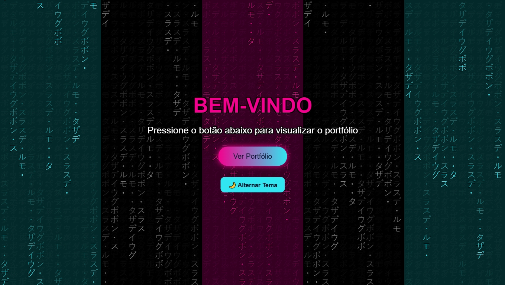
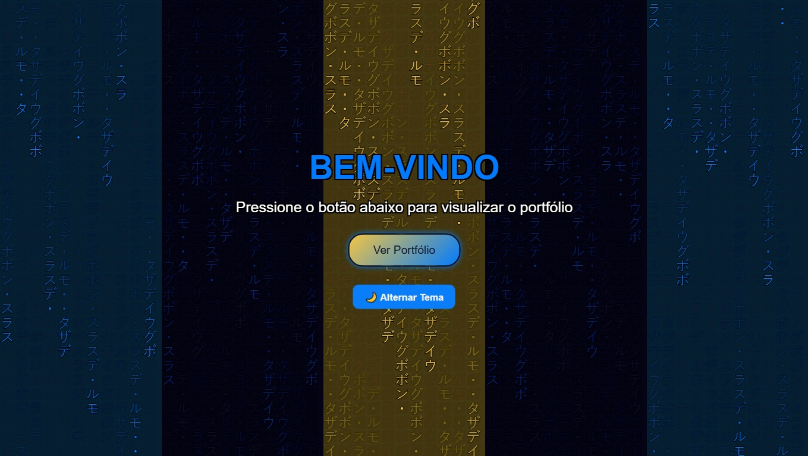
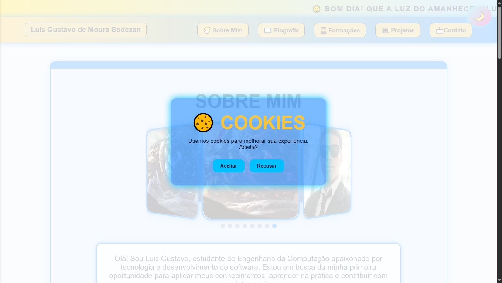
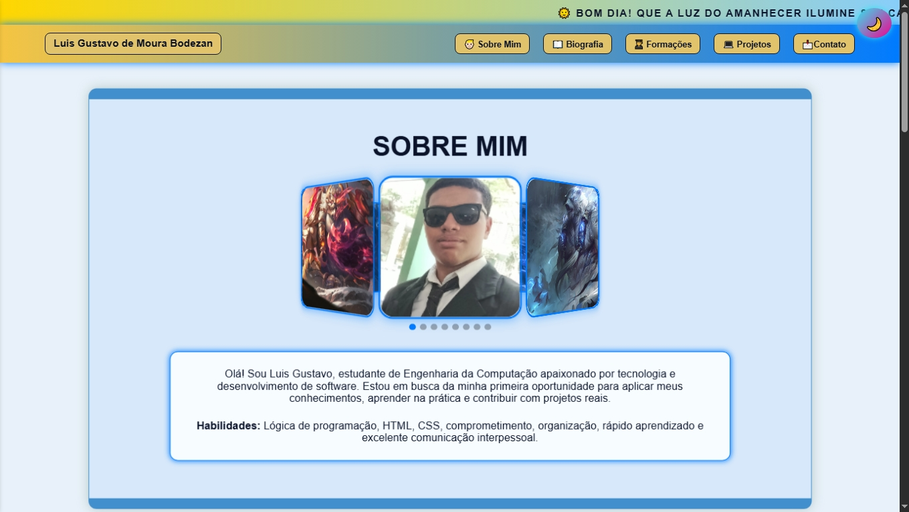
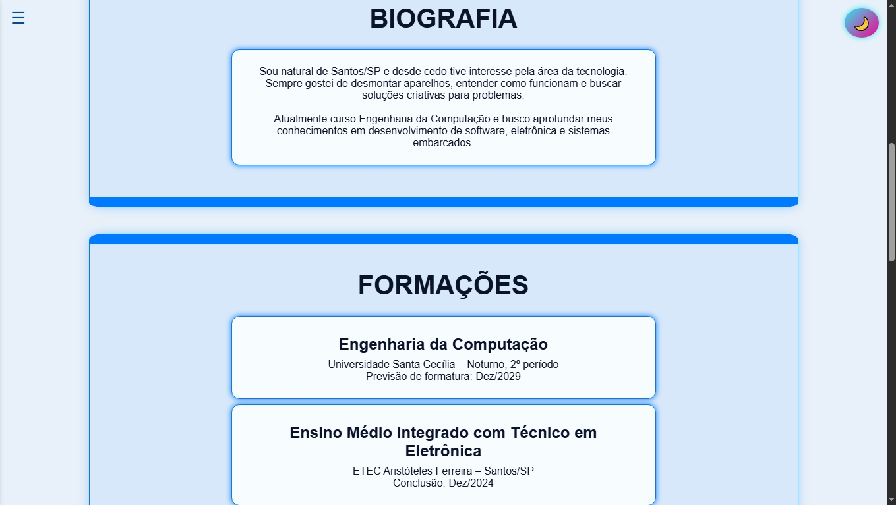
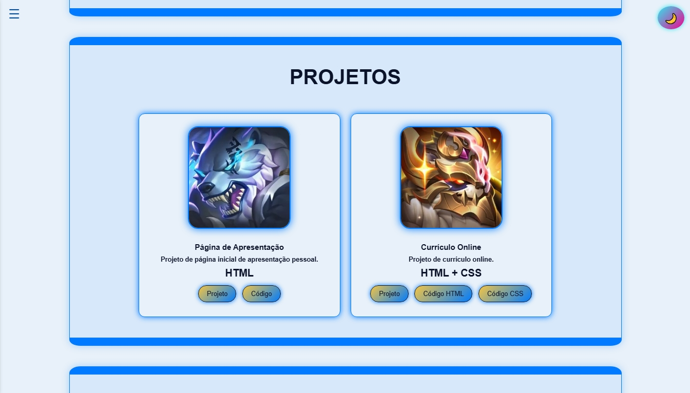

# 📁 Portfólio Pessoal – Parte 2

Este é meu projeto de **Portfólio P2**, desenvolvido no segundo semestre do curso **Engenharia da Computação** na disciplina **Tecnologia Web**.  

O objetivo é aplicar os conhecimentos adquiridos em **HTML**, **CSS**, **JS** e **Flexbox**, criando um site pessoal moderno, responsivo e que possa servir como apresentação para oportunidades futuras.

---

## 📌 Sobre o Projeto

O portfólio é dividido em duas páginas principais:  

1. **Página Inicial** – Tela de boas-vindas, botão de acesso à página principal e um botão de troca de tema claro/escuro.

2. **Página Portfólio** – Apresenta informações detalhadas:
Sobre Mim – Apresentação com carrossel 3D de fotos de perfil e um breve resumo sobre mim.
Biografia – Resumo da trajetória pessoal e acadêmica.
Formações – Minhas formações educacionais.
Projetos – Cards com links diretos para projetos e códigos já feitos.
Contato – Links para redes sociais e formulário de contato.
Rodapé – Informações do autor e direitos autorais. 

---

## 🧪 Funcionalidades

**Página Inicial**

__Fundo Matrix__
Apresenta um efeito visual tipo “Matrix” no background.

__Troca de Tema__
Permite alternar entre modo claro e escuro diretamente na página inicial.

**Página Portfólio**

__Troca de Tema__
Permite ao usuário alternar entre tema claro e escuro em toda a página principal, mantendo a experiência consistente.

__Mensagem Dinâmica de Saudação__
Mostra um texto de boas-vindas ou saudação dependendo do horário do dia, tornando o site mais interativo.

__Modais__
Exibe caixas de diálogo para anúncios, cookies, termos de uso e boas-vindas, com botões de interação.

__Relógio Digital__
Exibe um relógio em tempo real ao lado da mensagem de saudação.

__Carrossel 3D__
Um carrossel de imagens com efeito 3D, permitindo navegação interativa entre fotos de perfil.

__Validação de Formulário__
Verifica se os campos obrigatórios do formulário de contato foram preenchidos corretamente antes de enviar.

__Envio de Mensagem via EmailJS__
Permite enviar mensagens diretamente do formulário de contato para seu email usando o serviço EmailJS.

__Menu Hambúrguer__
Menu lateral responsivo para dispositivos móveis, que expande e recolhe ao clicar no ícone, mantendo os links de navegação acessíveis.

---

## 🧰 Recursos Utilizados

- HTML5  
- CSS3 + Flexbox  
- Java Script
- Google Fonts  
- Font Awesome (ícones)  
- Paleta de cores personalizada  
- Imagens próprias  
- EmailJS

---

## 🎨 Protótipo

O protótipo foi desenvolvido no **Canva**:  

[🔗 Ver Protótipo](https://www.canva.com/design/DAGzXrReUfU/gsEdr1M1WGndluAL5hCevw/edit?utm_content=DAGzXrReUfU&utm_campaign=designshare&utm_medium=link2&utm_source=sharebutton)

---

## 🔗 Como Visualizar o Projeto

- Baixe/clonar este repositório e abra o arquivo `index.html` no navegador.  
- Ou acesse diretamente pelo **GitHub Pages**:  
  👉 [Clique aqui para abrir o site](https://luisbodezan.github.io/Portfolio_Parte2/)  

---

## 📸 Capturas de Tela

  
  
  
  
  
  
---

## 📄 Licença

Este projeto foi desenvolvido para **fins educacionais** como parte da disciplina **Tecnologia Web**.

---

## 🙋 Autor

**Luis Gustavo de Moura Bodezan – RA: 248054**  
Curso: Engenharia da Computação – Turma A  
Email: (luis.bodezan@gmail.com)  
GitHub: 👉 [Clique aqui](https://github.com/LuisBodezan)  
LinkedIn: 👉 [Clique aqui](https://www.linkedin.com/in/luis-gustavo-bodezan-11aa68347)
